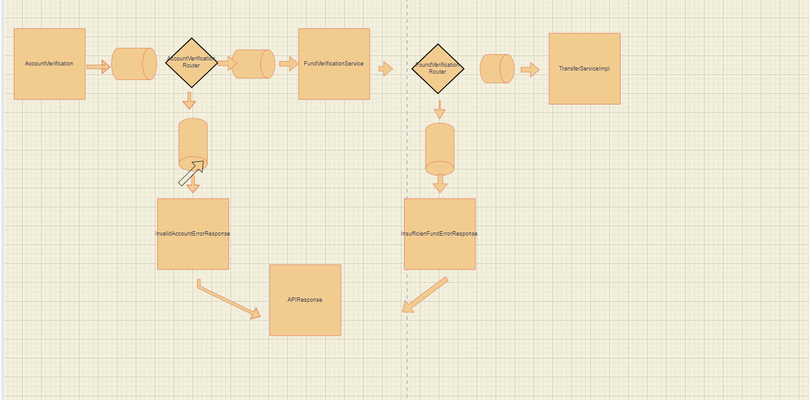

## Spring boot integration

## SBI-APP


Start the application (runs on port 8080)

URL : http://localhost:8080/transferFunds

METHOD : POST

Request data :
```bash
{
"requestId": "ram1234",
"senderAccountNumber": "SBI12356ACCNUM",
"senderbankIFSCCode": "SBI00034",
"toAccountNumber": "HDFC12346ACCNUM",
"recipientIFSCCode": "HDF14448",
"amount": 10033.0
}
```


## System Flow


